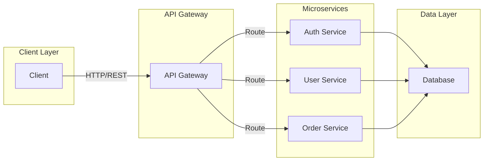
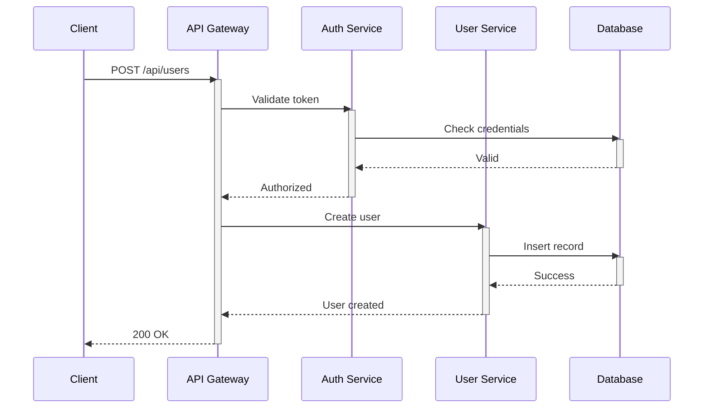
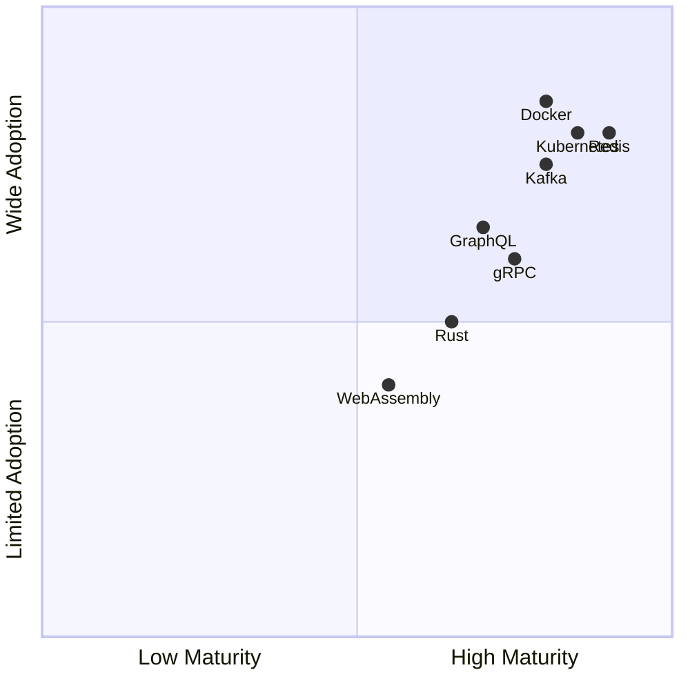

# Diagram Examples: Architecture Visualization Formats

This guide demonstrates how to represent a microservices system architecture using different visualization formats. Architecture: Client -> API Gateway -> Auth Service, User Service, Order Service -> Database

## 1. Mermaid Flowchart

Best for: GitHub README files, Notion, Confluence, quick documentation



---

## 2. Mermaid Sequence Diagram

Best for: Showing request flow and interactions between services



---

## 3. D2 Diagram

Best for: Production architecture documentation, detailed layouts (compile with `d2` CLI)

```d2
direction: right

client: Client
gateway: API Gateway
auth: Auth Service
user: User Service
order: Order Service
db: Database

client -> gateway
gateway -> auth
gateway -> user
gateway -> order
auth -> db
user -> db
order -> db
```

---

## 4. TikZ Diagram

Best for: Academic papers, LaTeX documents, publication-quality diagrams

```latex
\documentclass{article}
\usepackage{tikz}
\usetikzlibrary{positioning,arrows.meta,shapes}

\begin{document}

\begin{tikzpicture}[
    node distance=2cm,
    box/.style={rectangle,draw,minimum width=2cm,minimum height=1cm}
]

    \node[box] (client) {Client};
    \node[box,below=of client] (gateway) {API Gateway};
    \node[box,below left=1.5cm and 2cm of gateway] (auth) {Auth Service};
    \node[box,below=of gateway] (user) {User Service};
    \node[box,below right=1.5cm and 2cm of gateway] (order) {Order Service};
    \node[box,below=of user] (db) {Database};

    \draw[->] (client) -- (gateway);
    \draw[->] (gateway) -- (auth);
    \draw[->] (gateway) -- (user);
    \draw[->] (gateway) -- (order);
    \draw[->] (auth) -- (db);
    \draw[->] (user) -- (db);
    \draw[->] (order) -- (db);

\end{tikzpicture}

\end{document}
```

---

## 5. ASCII Art

Best for: Terminal documentation, plain text files, version control

```
                              Client
                                |
                                v
                          API Gateway
                          /    |    \
                         /     |     \
                        v      v      v
                    Auth    User    Order
                   Service  Service  Service
                        \     |     /
                         \    |    /
                          \   |   /
                            v v v
                          Database
```

---

## 6. Technology Radar

Best for: Assessing technology adoption status across dimensions



---

## Comparison Matrix

| Format | GitHub | Notion | CLI Ready | Maintainability | Visual Quality |
|--------|--------|--------|-----------|-----------------|----------------|
| Mermaid Flowchart | Native | Native | No | Excellent | Good |
| Mermaid Sequence | Native | Native | No | Good | Good |
| D2 | Export only | Export only | Yes | Excellent | Excellent |
| TikZ | No | No | Yes | Good | Excellent |
| ASCII | All | All | Yes | Excellent | Fair |
| Quadrant Chart | Native | Native | No | Excellent | Good |

---

## When to Use Each Format

- **Mermaid Flowchart**: GitHub READMEs, quick architecture sketches, version control
- **Mermaid Sequence**: Request flows, API interactions, timing diagrams
- **D2**: Detailed architecture, professional documentation, SVG/PNG export
- **TikZ**: Academic papers, publications, LaTeX integration
- **ASCII**: Terminal output, text-based documentation, plain text compatibility
- **Quadrant Chart**: Technology assessment, maturity evaluation

All examples use default styling only for clean, maintainable, universally compatible diagrams.
