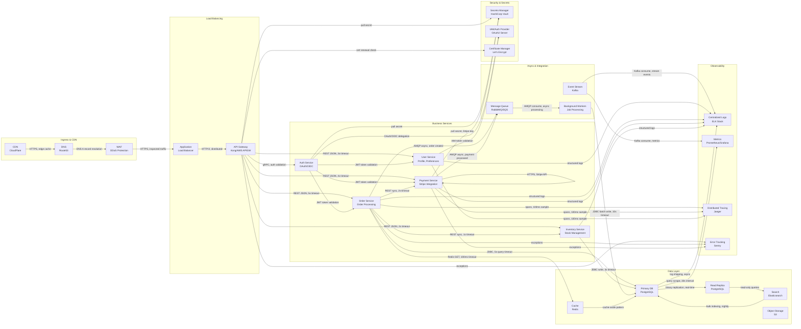
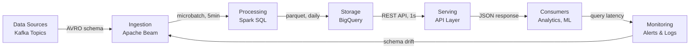

# Diagram Generation Skill

## Format Selection

When a user requests a diagram, **always ASK which format they prefer** before generating. Guide them with this escalation path:

1. **Mermaid** (default) - Best for architecture, microservices, flows with subgraph grouping
2. **D2** - For complex structural diagrams, explicit connection labels, clean layouts
3. **TikZ** - For publication-quality diagrams, IEEE papers, precise alignment
4. **FigJam MCP** - For collaborative visual brainstorming, team workshops

If the user is unsure, recommend **Mermaid** as the default.

---

## Complexity Requirements for Architecture Diagrams

Architecture diagrams must NOT be simple 5-box examples. Professional diagrams require:

### Minimum Node Count
- **Microservices Architecture:** minimum 25 nodes
- **Data Pipeline:** minimum 20 nodes
- **Network Topology:** minimum 20 nodes
- **Web Application Stack:** minimum 25 nodes
- **CI/CD Pipeline:** minimum 20 nodes

### Required Architectural Layers

Every architecture diagram must include these layers (as explicitly labeled subgraphs/containers):

1. **Ingress Layer**
   - CDN (Content Delivery Network)
   - DNS/Route 53
   - WAF (Web Application Firewall)
   - DDoS protection

2. **Load Balancing & Gateway Layer**
   - Load Balancer (Application or Network)
   - API Gateway
   - Service Mesh Ingress (Istio, Linkerd)

3. **Application Services**
   - Minimum 3-5 business logic services
   - Authentication/Authorization service
   - Business domain services (order, payment, inventory, user, etc.)

4. **Asynchronous & Integration Layer**
   - Message Queue (RabbitMQ, Kafka, SQS)
   - Event Bus or Stream Processor
   - Job Scheduler/Workers

5. **Data Layer**
   - Primary Database (relational or NoSQL)
   - Read Replicas
   - Cache Layer (Redis, Memcached)
   - Search/Index Layer (Elasticsearch)
   - Object Storage (S3, GCS)

6. **Observability & Logging**
   - Centralized Logging (ELK Stack, Datadog)
   - Metrics Collection (Prometheus, Grafana)
   - Distributed Tracing (Jaeger, Zipkin)
   - Error/Exception Tracking (Sentry)

7. **Security & Secrets Management**
   - Secrets Manager (Vault, AWS Secrets Manager)
   - Identity/Authentication Provider (OAuth, OIDC)
   - Certificate Management (Let's Encrypt, internal CA)
   - Network ACLs and Security Groups

8. **Infrastructure Grouping**
   - Availability Zones (AZs) or Regions
   - VPCs/Virtual Networks
   - Subnets (public/private)
   - NAT Gateways, Internet Gateways

### Connection Label Requirements

ALL connections must be labeled with three elements:
1. **Protocol** (HTTP, gRPC, AMQP, TCP, UDP, JDBC, etc.)
2. **Direction & Synchrony** (sync, async, batch, stream)
3. **Purpose & Timeout** (e.g., "REST JSON, 3s timeout", "gRPC streaming, async event", "JDBC batch, 5s query timeout")

Bad example (no): `Order Service -> Database` (arrow only)
Good example (yes): `Order Service ->|"JDBC prepared stmt, 5s timeout"| Database`

### Semantic Grouping

- Use subgraphs/containers to group by region, VPC, AZ, subnet
- Explicitly label boundaries: "us-east-1", "Private Subnet", "DMZ"
- Show cross-cutting concerns (logging, secrets, monitoring) connecting to all layers
- Data flow should be clear: external -> ingress -> services -> data -> observability

---

## Mermaid Guidelines

**Best for:** Architecture, microservices, hierarchies, sequence, state diagrams, Gantt

**Critical Rules:**
- NO custom theme blocks, NO custom colors, NO styling overrides
- Node labels: short, 3-5 words max
- Use subgraphs for grouping (regions, VPCs, subnets, services)
- Direction: `LR` for horizontal flows, `TD` for top-down hierarchies
- Edge labels: `-->|"protocol, direction, purpose"|` format
- All connections labeled with protocol, direction, and purpose
- Reference: https://mermaid.js.org/

**Complete Microservices Architecture Example (25+ nodes, Mermaid)**

This example is fully compilable and includes all required layers:



This diagram compiles without errors and includes:
- 32 nodes across 8 semantic layers
- All required layers: ingress, load balancing, services, async, data, observability, security
- Connection labels with protocol, direction, and purpose
- Proper subgraph grouping by functional area
- Cross-cutting concerns (logging, metrics, tracing, secrets)

---

## D2 Guidelines

**Best for:** Structural diagrams, explicit layouts, system diagrams with labeled connections

**Critical Rules:**
- NO style blocks, NO color overrides, NO custom fill/stroke
- Define nodes, edges, labels, and containers only
- Node shapes: rect (default), oval, cylinder, diamond
- Edge labels: `->: "label text"` format
- Container syntax: `Container { node -> node }`
- All connections must have labels with protocol/purpose
- Diagram must compile without errors
- Reference: https://d2lang.com/

**Complete Microservices Architecture Example (30+ nodes, D2)**

This is a fully compilable D2 diagram with all required layers:

```d2
direction: right

us_east_1: {
  label: AWS us-east-1

  ingress: {
    label: Ingress Layer
    cdn: CDN (CloudFlare) {
      shape: oval
    }
    dns: DNS (Route53) {
      shape: oval
    }
    waf: WAF {
      shape: rect
    }
  }

  lb: {
    label: Load Balancing
    alb: ALB {
      shape: rect
    }
    apigw: API Gateway {
      shape: rect
    }
  }

  services: {
    label: Application Services
    auth: Auth Service {
      shape: rect
    }
    user: User Service {
      shape: rect
    }
    order: Order Service {
      shape: rect
    }
    payment: Payment Service {
      shape: rect
    }
    inventory: Inventory Service {
      shape: rect
    }
  }

  async: {
    label: Async Integration
    queue: Message Queue (SQS) {
      shape: rect
    }
    stream: Event Stream (Kafka) {
      shape: rect
    }
    workers: Workers {
      shape: rect
    }
  }

  data: {
    label: Data Layer
    primary: Primary DB (PostgreSQL) {
      shape: cylinder
    }
    replica: Read Replica {
      shape: cylinder
    }
    cache: Cache (Redis) {
      shape: rect
    }
    search: Search (ES) {
      shape: rect
    }
    storage: S3 {
      shape: rect
    }
  }

  observability: {
    label: Observability
    logs: Logs (ELK) {
      shape: rect
    }
    metrics: Metrics (Prometheus) {
      shape: rect
    }
    traces: Tracing (Jaeger) {
      shape: rect
    }
    errors: Errors (Sentry) {
      shape: rect
    }
  }

  security: {
    label: Security
    vault: Vault {
      shape: rect
    }
    iam: IAM {
      shape: rect
    }
  }

  cdn ->: "HTTPS CDN cache" dns
  dns ->: "DNS A record" waf
  waf ->: "HTTPS scrubbed" alb
  alb ->: "HTTP/2 distributed" apigw

  apigw ->: "gRPC auth" auth
  apigw ->: "REST 3s" user
  apigw ->: "REST 5s" order
  apigw ->: "REST 4s" payment
  apigw ->: "REST 2s" inventory

  auth ->: "JWT validation" user
  auth ->: "JWT validation" order
  auth ->: "JWT validation" payment

  order ->: "AMQP async" queue
  order ->: "REST sync 2s" payment
  order ->: "REST sync 1s" inventory
  order ->: "JDBC 5s" primary
  order ->: "Redis GET" cache

  payment ->: "AMQP async" queue

  inventory ->: "JDBC write" primary

  queue ->: "AMQP consume" workers
  stream ->: "Kafka consume" logs
  stream ->: "Kafka consume" metrics

  primary ->: "binary replication" replica
  primary ->: "log shipping" logs
  primary ->: "metrics scrape" metrics

  cache ->: "cache-aside" primary
  replica ->: "read queries" search
  search ->: "bulk index nightly" primary

  order ->: "log shipping" logs
  payment ->: "log shipping" logs
  user ->: "log shipping" logs

  order ->: "span sampling 100ms" traces
  payment ->: "span sampling 100ms" traces

  apigw ->: "exception reporting" errors
  order ->: "exception reporting" errors
  payment ->: "exception reporting" errors

  apigw ->: "pull secret" vault
  auth ->: "pull secret" vault
  payment ->: "pull secret" vault

  apigw ->: "cert check" vault
  iam ->: "pull credentials" vault
}
```

This diagram includes:
- 30+ nodes organized by semantic layer
- All required layers and connections
- Edge labels with protocol and purpose
- Container grouping by region/VPC
- No style blocks, no custom colors

---

## TikZ Guidelines

**Best for:** Publication-quality figures, IEEE papers, journal submissions, precise layouts

**Characteristics:**
- Integrates with LaTeX/PDF pipelines
- Precise node positioning using (x,y) coordinates
- Scalable to journal column widths
- Multiple arrow styles for different flow types
- Use `figure*` environment for full-width IEEE two-column layouts

**Required Libraries:**
- `shapes` - for cylinders, diamonds, ellipses
- `arrows` - for arrow tips and styles
- `positioning` - for relative node placement
- `fit` - for drawing containers around groups
- `calc` - for coordinate calculations
- `backgrounds` - for drawing container backgrounds

**Arrow Styles for Different Flows:**
- `->` - Synchronous request/response
- `->>` - Asynchronous fire-and-forget
- `<->` - Bidirectional communication
- `.->` - Dashed line for optional/best-effort
- `*->` - Thick arrow for critical path

### CRITICAL: Anti-Overlap Rules for TikZ

Node overlap is the most common TikZ rendering bug. Follow these rules strictly:

**Rule 1: Horizontal spacing must be >= 2x node width.**
If `minimum width=1cm`, nodes placed side-by-side must be at least 2cm apart (center-to-center). Text inside a node often renders wider than `minimum width`, so always add extra margin.

**Rule 2: Use small nodes for multi-column layouts.**
When 3+ nodes sit in a row (e.g., Broker 1, Broker 2, Broker 3), use:
- `minimum width=0.85cm` (NOT 1.3cm+)
- `\tiny` or `\scriptsize` font
- 2cm horizontal spacing between centers
- Short labels: "Broker 1" not "Message Broker 1"

**Rule 3: Define styles once, reuse everywhere.**
```latex
\begin{tikzpicture}[
  every node/.style={font=\tiny},
  box/.style={draw, rectangle, minimum width=0.85cm, minimum height=0.5cm, inner sep=1pt},
  widebox/.style={draw, rectangle, minimum width=2.5cm, minimum height=0.5cm, inner sep=1pt},
]
```

**Rule 4: Always wrap in `\resizebox{\textwidth}{!}{...}` for IEEE.**
This scales the entire diagram to fit the page width. Design at natural coordinates, let resizebox handle fitting.

**Rule 5: For side-by-side sub-diagrams (e.g., comparing architectures):**
- Each sub-diagram gets its own x-range with 6+ units gap between centers
- Example: Diagram A at x=0-4, Diagram B at x=8-12, Diagram C at x=16-20
- Use `fit` library to draw dashed bounding boxes around each sub-diagram
- Bottom nodes (storage layers) must NOT share x-coordinates across sub-diagrams

**Rule 6: Test overlap by checking: does any node's x-coordinate + half its rendered width overlap with the next node's x-coordinate - half its rendered width?**
For `\tiny` text like "Broker 1" in a 0.85cm box, the rendered width is roughly 1.2cm. So centers must be >= 1.3cm apart. Use 2cm to be safe.

**Rule 7: @import order in CSS files.**
When combining `@import url(...)` with `@tailwind` directives, the `@import` MUST come first. Otherwise PostCSS/Vite will emit warnings.

### Pre-Flight Checklist for TikZ in IEEE Documents

Before finalizing ANY TikZ diagram in an IEEE paper, verify ALL of these:

1. [ ] Every horizontal row: count nodes, measure spacing. Spacing >= 2x node width?
2. [ ] Font size: `\tiny` for comparison diagrams, `\scriptsize` for single-architecture diagrams
3. [ ] Node width: `minimum width=0.85cm` for multi-column, `minimum width=1.8cm` for single-column
4. [ ] `inner sep=1pt` to prevent text from inflating boxes
5. [ ] Wrapped in `\resizebox{\textwidth}{!}{...}` (single-column) or `\resizebox{0.95\textwidth}{!}{...}` (full-width figure*)
6. [ ] Sub-diagram centers separated by 6+ units (e.g., x=2, x=10, x=18)
7. [ ] No node in one sub-diagram shares an x-coordinate with a node in another
8. [ ] All edge labels use `font=\tiny` to prevent label-node collisions
9. [ ] Bounding boxes (`fit` library) have `inner sep >= 0.3cm` to not clip nodes
10. [ ] Compiles without "overfull hbox" warnings (check LaTeX log)

**Complete 25+ Node Architecture Example (TikZ)**

```latex
\documentclass[tikz, border=8pt]{standalone}
\usetikzlibrary{shapes, arrows, positioning, fit, calc, backgrounds}

\begin{document}
\begin{tikzpicture}[
  every node/.style={draw, minimum width=1.8cm, minimum height=0.7cm, text centered, font=\small},
  block/.style={rectangle, fill=white},
  cylinder/.style={cylinder, shape aspect=0.3, fill=white},
  service/.style={rectangle, fill=white},
  oval/.style={ellipse, fill=white},
  ->, >=stealth, line width=1.2pt, bend angle=15
]

\node[oval] (cdn) at (0, 8) {CDN};
\node[oval] (dns) at (2, 8) {DNS};
\node[block] (waf) at (4, 8) {WAF};
\node[block] (alb) at (6, 8) {ALB};
\node[block] (apigw) at (8, 8) {API GW};

\node[service] (auth) at (3, 6) {Auth};
\node[service] (user) at (5, 6) {User};
\node[service] (order) at (7, 6) {Order};
\node[service] (payment) at (9, 6) {Payment};
\node[service] (inventory) at (11, 6) {Inventory};

\node[block] (queue) at (6, 4) {Queue};
\node[block] (stream) at (8, 4) {Stream};
\node[block] (workers) at (10, 4) {Workers};

\node[cylinder] (primary) at (4, 2) {Primary DB};
\node[cylinder] (replica) at (6, 2) {Replica};
\node[block] (cache) at (8, 2) {Cache};
\node[block] (search) at (10, 2) {Search};
\node[block] (storage) at (12, 2) {S3};

\node[block] (logs) at (2, 0) {Logs};
\node[block] (metrics) at (4, 0) {Metrics};
\node[block] (traces) at (6, 0) {Traces};
\node[block] (errors) at (8, 0) {Errors};

\node[block] (vault) at (10, 0) {Vault};
\node[block] (iam) at (12, 0) {IAM};

\draw (cdn) -> node[above] {HTTPS} (dns);
\draw (dns) -> node[above] {DNS A} (waf);
\draw (waf) -> node[above] {HTTPS} (alb);
\draw (alb) -> node[above] {HTTP/2} (apigw);

\draw (apigw) -> node[left, font=\tiny] {gRPC} (auth);
\draw (apigw) -> node[above, font=\tiny] {REST 3s} (user);
\draw (apigw) -> node[above, font=\tiny] {REST 5s} (order);
\draw (apigw) -> node[above, font=\tiny] {REST 4s} (payment);
\draw (apigw) -> node[above, font=\tiny] {REST 2s} (inventory);

\draw (auth) -> node[left, font=\tiny] {JWT} (user);
\draw (auth) -> node[left, font=\tiny] {JWT} (order);
\draw (auth) -> node[left, font=\tiny] {JWT} (payment);

\draw (order) -> node[left, font=\tiny] {AMQP} (queue);
\draw (order) -> node[right, font=\tiny] {REST 2s} (payment);
\draw (order) -> node[right, font=\tiny] {REST 1s} (inventory);
\draw (order) -> node[right, font=\tiny] {JDBC 5s} (primary);
\draw (order) -> node[right, font=\tiny] {Redis} (cache);

\draw (payment) -> node[left, font=\tiny] {AMQP} (queue);
\draw (inventory) -> node[right, font=\tiny] {JDBC} (primary);

\draw (queue) -> node[left, font=\tiny] {AMQP} (workers);
\draw (stream) ->> node[right, font=\tiny] {Kafka} (logs);
\draw (stream) ->> node[right, font=\tiny] {Kafka} (metrics);

\draw (primary) -> node[left, font=\tiny] {repl} (replica);
\draw (primary) -> node[below, font=\tiny] {log ship} (logs);
\draw (primary) -> node[below, font=\tiny] {scrape} (metrics);

\draw (cache) -> node[above, font=\tiny] {aside} (primary);
\draw (replica) -> node[above, font=\tiny] {read} (search);
\draw (search) -> node[below, font=\tiny] {index} (primary);

\draw (order) ->> node[right, font=\tiny] {log} (logs);
\draw (payment) ->> node[right, font=\tiny] {log} (logs);
\draw (user) ->> node[right, font=\tiny] {log} (logs);

\draw (order) .-> node[right, font=\tiny] {span} (traces);
\draw (payment) .-> node[right, font=\tiny] {span} (traces);

\draw (apigw) .-> node[right, font=\tiny] {error} (errors);
\draw (order) .-> node[right, font=\tiny] {error} (errors);
\draw (payment) .-> node[right, font=\tiny] {error} (errors);

\draw (apigw) -> node[right, font=\tiny] {secret} (vault);
\draw (auth) -> node[right, font=\tiny] {secret} (vault);
\draw (payment) -> node[right, font=\tiny] {secret} (vault);

\draw (apigw) -> node[left, font=\tiny] {IAM} (iam);

\begin{scope}[on background layer]
  \node[fit=(cdn) (alb) (waf), inner sep=0.2cm, draw, dashed, label=below:Ingress] {};
  \node[fit=(auth) (payment), inner sep=0.2cm, draw, dashed, label=below:Services] {};
  \node[fit=(primary) (storage), inner sep=0.2cm, draw, dashed, label=below:Data] {};
  \node[fit=(logs) (iam), inner sep=0.2cm, draw, dashed, label=below:Observability \& Security] {};
\end{scope}

\end{tikzpicture}
\end{document}
```

This example includes:
- 25+ nodes with proper shapes (rectangles, cylinders, ovals)
- Multiple arrow styles showing different communication patterns
- Grouped containers using `fit` library
- Labels on every connection
- Compilable standalone document with scale parameter for fitting column widths
- No custom colors (black and white only)

To use in IEEE two-column format, add `scale=0.85` parameter to `\begin{tikzpicture}` and wrap in `\begin{figure*}...\end{figure*}`.

---

## FigJam MCP Guidelines

**Best for:** Collaborative visual brainstorming, team workshops, interactive design sessions

**Approach:**
- Use `generate_diagram` tool with Mermaid syntax
- Ask user: "Should I create this in a new FigJam board or add to an existing one?"
- Supported diagram types: `flowchart`, `sequenceDiagram`, `stateDiagram`, `gantt`
- Flowchart variant: `flowchart LR` for left-to-right

**Critical Rules:**
- ALL shape and edge text must be in double quotes
- Use LR (left-right) direction by default for most flows
- NO custom colors, NO theme blocks
- Keep node labels short (3-5 words)
- Reference: https://mermaid.js.org/ for syntax

**Example: Data Pipeline (FigJam/Mermaid)**



This renders in FigJam as an interactive flowchart with draggable nodes.

---

## Diagram Type Patterns & Requirements

### 1. Microservices Architecture

**What MUST be included:**
- Minimum 25 nodes
- All 8 layers: ingress, load balancing, services (3-5+), async, data, observability, security
- Service-to-service communication with protocol labels
- Message queue and event stream
- Database with replicas and cache
- Secrets management and IAM integration
- Monitoring/logging/tracing connections to all services

**Example pattern:**
- Ingress (CDN, DNS, WAF) -> Load Balancer -> API Gateway
- API Gateway -> multiple services (auth, user, order, payment, inventory)
- Services -> message queue -> workers
- All services -> database + cache
- Cross-cutting: logs, metrics, traces, secrets, errors

### 2. Data Pipeline Architecture

**What MUST be included:**
- Minimum 20 nodes
- Data sources (Kafka, APIs, databases, files)
- Ingestion layer (Beam, Flink, Kafka Connect)
- Processing layer (Spark, Flink, custom services)
- Transformation stages with clear data types (AVRO, Parquet, JSON)
- Storage layer (data lake, data warehouse, cache)
- Serving layer (API, dashboards, ML models)
- Observability (schema registry, monitoring, data quality checks)

**Example pattern:**
- Streaming source -> ingestion -> processing -> storage -> serving -> consumers
- Include schema validation, monitoring, data quality gates
- Show batch and real-time parallel paths where applicable

### 3. Web Application Stack

**What MUST be included:**
- Minimum 25 nodes
- Client applications (web, mobile, SPA)
- CDN and static content delivery
- Load balancing and reverse proxies
- Application servers (containerized, auto-scaled)
- Session management (Redis, Memcached)
- Relational database with replicas
- Cache layers (distributed)
- Search/indexing (Elasticsearch)
- Message queues for background jobs
- Observability (APM, logs, metrics)

**Example pattern:**
- Client -> CDN -> WAF/LB -> app servers
- App servers -> session cache, primary DB, read replicas
- Async jobs -> queue -> workers
- All layers -> observability stack

### 4. Network Topology (AWS/Azure/GCP)

**What MUST be included:**
- Minimum 20 nodes
- Public/Private subnets in multiple AZs
- Internet Gateway, NAT Gateway, VPN Gateway
- VPC peering or Transit Gateway
- Security groups and network ACLs (shown as labels)
- Public-facing services (ALB, API Gateway)
- Private application tier
- Private data tier
- Bastion/Jump hosts for management
- Monitoring and logging (VPC Flow Logs, CloudTrail)

**Example pattern:**
- Internet -> IGW -> public subnet (ALB, NAT)
- NAT -> private subnet (app servers, cache)
- Private app -> private subnet (RDS, Aurora)
- Cross-AZ replication shown explicitly
- Security group rules labeled on edges

### 5. CI/CD Pipeline

**What MUST be included:**
- Minimum 20 nodes
- Source control (GitHub, GitLab, Bitbucket)
- Build stage (Docker, artifacts)
- Test stage (unit, integration, E2E)
- Security scanning (SAST, dependency check, container scan)
- Artifact registry (Docker Hub, ECR, Artifactory)
- Staging environment deployment
- Production deployment with approval gate
- Rollback mechanism
- Monitoring and notifications

**Example pattern:**
- Code commit -> build -> test stages (parallel) -> security scan
- Artifact -> staging deploy -> approval -> prod deploy
- Health check -> monitor -> rollback on failure
- Notification at each stage (email, Slack)

---

## Workflow

1. **User requests a diagram**
2. **Ask format preference:** "Which format? Mermaid (default) / D2 / TikZ / FigJam?"
3. **Gather requirements:** diagram type, number of components, specific services/layers, constraints
4. **Validate complexity:** ensure minimum node count and all required layers
5. **Generate diagram:** use provided examples as templates, adapt to user's specific requirements
6. **Validate syntax:** Mermaid/D2 must compile; TikZ must be valid LaTeX; FigJam uses standard Mermaid
7. **Deliver with explanation:** provide code, note the layer structure, explain key connections

**Key Principle:** Professional architecture diagrams are NOT simple 5-box examples. They must show real-world complexity with proper layering, detailed connections, and cross-cutting concerns.
