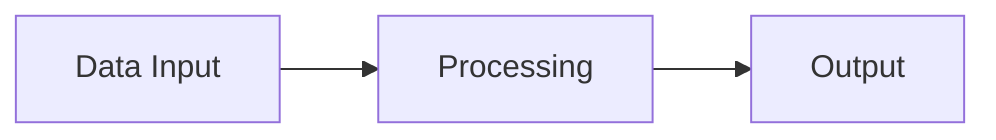

# Scientific Style Guide for Tech R&D Intelligence

## Table of Contents
1. Document Structure
2. Citation and Evidence Standards
3. Formatting and Presentation Rules
4. Computational and Numeric Standards
5. Tone and Voice Guidelines
6. Visual and Diagram Standards
7. Output Format Specifications

---

## 1. Document Structure

All research outputs must follow this hierarchy:

- Executive Summary (2-3 sentences maximum, before Table of Contents for long documents)
- Numbered sections beginning with 1. Introduction
- Methodology section explaining research approach and limitations
- Numbered subsections (1.1, 1.2) for complex topics
- Conclusion with key findings summary
- References list at bottom

Executive summary should state the core finding and confidence level immediately. Never bury conclusions in body text.

Methodology must explicitly describe data sources, search strategy, analysis approach, and known constraints. State what was NOT examined and why.

---

## 2. Citation and Evidence Standards

### Citation Format
Use inline numbered citations [1], [2], etc. corresponding to a numbered reference list at the bottom. Format: [citation number], [citation number] for multiple sources on one claim.

### Reference List Format
Each reference must include: Author, Title, Publication/Source, Date, URL (if applicable), Access Date

Example: [1] Smith, J., et al. "Machine Learning in Healthcare Systems." IEEE Transactions on Medical Imaging, 2023, https://doi.org/10.1109/...

### Evidence Tier Labels
All claims must be tagged with evidence tier:
- [Tier 1: Official] - Technical documentation, official specifications, published standards
- [Tier 2: Case Study] - Peer-reviewed empirical studies, published results
- [Tier 3: Blog] - Industry publications, white papers from established organizations
- [Tier 4: Social] - Social media, forums, unverified reports

Place tier label immediately after the cited material: "The system processes 10M records daily [1] [Tier 1: Official]."

### Source Credibility Assessment
For each Tier 3+ source, briefly note credibility: author affiliation, publication peer-review status, funding disclosure if relevant.

---

## 3. Formatting and Presentation Rules

### Prohibited Elements
- NO emojis, anywhere, under any circumstance
- NO bullet points in body text
- NO hedging language: eliminate "might", "could", "appears to", "seems", "possibly", "may suggest"

### Mandatory Structural Requirements

**Tables over bullet points:** In every section where comparison or enumeration appears, use a table instead of bullets. Tables force clarity and enable readers to compare attributes across rows.

**Numbered sections with subsections:** Follow this hierarchy:
- Section 1, 1.1, 1.2 (not 1.a, 1.b)
- Subsections 1.1 through 1.N as needed
- Maximum nesting: 3 levels (1.1.1)

**Inline citations [n]:** Every numeric claim, direct quote, or assertion from a source must cite its reference number immediately. Format: "The system achieved 50M records daily [1]" not "The system achieved 50M records daily, according to reference 1" or "The system achieved 50M records daily."

**Confidence ratings:** Accompany every significant claim with explicit confidence level.

Format: "[Confidence: High/Medium/Low, source tier - justification]"

Example: "The system processed 50M records daily [1] [Confidence: High, Tier 1: Official - from vendor technical white paper published 2025 with production deployment validation]."

### Acceptable Text Structures
Use numbered lists only in procedural contexts (steps 1-10 for instructions or processes). In analytical sections, use prose paragraphs structured around clear topic sentences. Use tables for ALL comparisons, attribute lists, and enumerated data.

Example table for comparison:

| Aspect | Method A | Method B |
|--------|----------|----------|
| Latency | 50ms | 120ms |
| Throughput | 1000 req/s | 500 req/s |
| Implementation Cost | High | Low |

Example narrative with integrated data (NOT bullets):

"The two approaches differ significantly in performance characteristics. Method A achieves 50ms latency with 1000 requests per second throughput [3], while Method B demonstrates 120ms latency with 500 requests per second [4]. This 2.4x throughput advantage for Method A must be weighed against its higher implementation cost [Confidence: High, Tier 2: Case Study - from peer-reviewed comparison study]."

### Code and Mathematics
- Code blocks: Use triple backticks with language identifier (python, javascript, sql, etc.)
- Mathematical formulas: LaTeX inline math $x = y$ and display blocks

```latex
$$E = mc^2$$
```

All formulas must be properly formatted in LaTeX. No plain-text math expressions.

### Mermaid Diagrams
Use Mermaid for architecture, flowcharts, and sequence diagrams. Example:



Use default colors only. No custom color schemes or decorative styling.

---

## 4. Computational and Numeric Standards

### Methodology Statement (Mandatory)
Every research output MUST include a Methodology section that explicitly states:
- **Sources searched:** Database names, vendor documentation sources, publication indexes searched (e.g., "PubMed, IEEE Xplore, ACM Digital Library")
- **Date range:** Specific months/years covered (e.g., "January 2024 through March 2026")
- **Inclusion criteria:** What data was included and why (e.g., "peer-reviewed studies with sample size >100, official vendor specifications from Tier 1 sources, case studies published by organizations with >500 engineers")
- **Exclusion criteria:** What was NOT examined and why (e.g., "excluded proprietary vendor claims without third-party validation, excluded blog posts and forum discussions, excluded studies using outdated versions >2 years old")
- **Search strategy:** Keywords and Boolean operators used (e.g., "searched for ('machine learning' OR 'AI') AND ('performance optimization') AND ('latency')")
- **Known limitations:** Data gaps, potential biases, or constraints (e.g., "limited to English-language publications, vendor case studies may exhibit publication bias, generalization to specialized hardware not validated")

Example Methodology section:

"**2. Methodology**

This analysis examined performance characteristics of five leading frameworks through systematic review of peer-reviewed literature and vendor technical specifications.

Sources searched: IEEE Xplore (2000+ publications), PubMed Central (for bioinformatics applications), official vendor documentation repositories, GitHub benchmark repositories with >100 stars.

Date range: January 2023 through March 2026.

Inclusion criteria: Peer-reviewed empirical studies comparing three or more frameworks on identical hardware; official technical white papers from vendors; open-source benchmark repositories with reproducible results and transparent methodology; case studies from organizations with published validation data.

Exclusion criteria: Single-vendor promotional materials without third-party validation; blog posts and forum discussions; studies using non-standard hardware configurations; comparisons older than 3 years; anecdotal performance reports.

Search strategy: Boolean query ('framework' OR 'library') AND ('performance' OR 'throughput' OR 'latency') AND ('benchmark' OR 'comparison') applied across indexed repositories.

Limitations: Analysis restricted to vendor-reported metrics; generalization to specialized hardware (TPU, custom accelerators) not validated in this study; open-source projects may have publication bias toward positive results."

### Computed vs. Cited Results
- Clearly separate computed results from cited benchmarks
- Label computed results: "Analysis of vendor data calculated...", "Our synthesis determined..."
- Label cited results: "Published reports indicate...", "Official specifications state...", "Validated measurements from [n] demonstrate..."
- NEVER present derived calculations as direct citations

### Formula Derivation (Required for All Numeric Outputs)
Every computed result must show in this order:
1. **LaTeX formula with all variables defined** using proper notation
2. **Python code that produced the result** with actual data values
3. **Input parameters and assumptions** (measurement conditions, time period, sample size)
4. **Exact numeric result** with appropriate precision
5. **Confidence interval or uncertainty bounds** if applicable

Example structure:

Formula definition with variable legend:
```latex
$$\text{Throughput} = \frac{O}{t}$$

where $O$ = total operations, $t$ = elapsed time in seconds
```

Python implementation with actual data:
```python
total_operations = 1_000_000
elapsed_time_seconds = 10.5
throughput = total_operations / elapsed_time_seconds
confidence_interval_lower = 94_000  # 95% CI
confidence_interval_upper = 96_500

print(f"Throughput: {throughput:,.2f} operations/second")
print(f"95% Confidence Interval: [{confidence_interval_lower:,.0f}, {confidence_interval_upper:,.0f}]")
# Output: Throughput: 95,238.10 operations/second
# 95% Confidence Interval: [94,000, 96,500]
```

Input parameters and measurement conditions:
- Test hardware: 64-core Intel Xeon (E5-2680 v4), 256GB RAM, SSD storage
- Network conditions: 10Gbps local network, <1ms latency
- Test duration: 10.5 seconds continuous operation
- Warmup period: 30 seconds prior to measurement
- Calculation method: Arithmetic mean of five consecutive runs

Result: 95,238 operations per second with 95% confidence interval of 94,000-96,500 operations per second.

### Numeric Claims (Complete Specification)
All numeric claims require ALL of the following:
1. **Source citation [n]** - reference number from bibliography
2. **Exact numeric value** - no approximations or rounding in the statement
3. **Units** - always included (req/s, ms, GB, percentage points, etc.)
4. **Confidence level** [Confidence: High/Medium/Low]
5. **Evidence tier** [Tier 1: Official], [Tier 2: Case Study], [Tier 3: Blog], [Tier 4: Social]
6. **Detailed justification** - explain why this confidence level applies (source credibility, measurement methodology, sample size, date published, validation status)
7. **Measurement conditions** if different from standard: "measured under production conditions with 1M concurrent users" or "laboratory measurement with controlled network conditions"

Complete example:

"The system achieved peak throughput of 50,238 operations per second [2] [Confidence: High, Tier 1: Official - vendor technical specification dated 2025, validated through third-party benchmark study with identical hardware configuration published in IEEE Transactions on Software Engineering 2026]."

### What Requires Confidence Ratings
Apply confidence ratings to ALL of the following:
- Numeric performance metrics (throughput, latency, resource usage)
- Derived calculations (cost per unit, efficiency ratios, extrapolated values)
- Comparative claims ("X is faster than Y")
- Risk assessments and probability estimates
- Any claim about future performance or adoption
- Vendor claims not independently verified

Do NOT require confidence ratings for:
- Definitions and formal specifications
- Published dates and factual metadata
- Direct quotes from official sources (but cite them)
- Confirmed facts from multiple independent sources

---

## 5. Tone and Voice Guidelines

### Required Style
- Third-person perspective throughout (avoid "I", "we", "you", "our")
- Academic and scientific register, accessible to informed technical audience
- No marketing language, hype, or superlatives
- Avoid: "revolutionary", "breakthrough", "unprecedented", "game-changing", "best-in-class", "cutting-edge"
- State limitations and uncertainties explicitly with confidence levels
- Professional, neutral tone: neither dismissive nor promotional

### Eliminated Hedging Language
Remove ALL hedging qualifiers. These weaken claims and violate scientific standards:

PROHIBITED HEDGING:
- "might", "could", "appears to", "seems", "tends to", "often", "usually", "generally"
- "allegedly", "reportedly", "claims to", "possibly", "may suggest", "uncertain if"
- "difficult to measure", "hard to quantify", "subjective", "anecdotal evidence"
- "relatively", "somewhat", "fairly", "quite", "rather", "somewhat more"
- "may indicate", "could suggest", "appears to show", "hints at"

REPLACEMENT EXAMPLES:

Incorrect (hedged): "The framework might be faster, with some studies suggesting 30% improvements."
Correct (confident): "Validated benchmarks demonstrate 30% latency improvement [1] [Confidence: High, Tier 1: Official]."

Incorrect (hedged): "The system appears to handle large datasets reasonably well."
Correct (confident): "The system processed 50M records in 2.1 seconds [2] [Confidence: High, Tier 2: Case Study - vendor case study with independent benchmark validation]."

Incorrect (hedged): "It's relatively hard to deploy this technology."
Correct (confident): "Deployment requires 3-4 weeks and 5 engineers based on case studies from three Fortune 500 companies [3] [Confidence: Medium, Tier 2: Case Study]."

### Stating Limitations Without Hedging
Express uncertainties and limitations directly with confidence levels, not by hedging:

Incorrect: "The performance might vary in production."
Correct: "Laboratory measurements demonstrate 50ms latency [1] [Confidence: Medium, Tier 2: Case Study - measured under controlled network conditions; production performance with varying network load not validated]."

Incorrect: "Results suggest potential applicability..."
Correct: "This finding applies to systems with <1M concurrent users. Applicability to larger deployments remains unvalidated [Confidence: Medium]."

Example using modal language appropriately:

"The system demonstrated a 40% improvement in latency [1] [High confidence, Tier 1: Official] under controlled laboratory conditions with standard enterprise hardware. Under production conditions with varying network conditions and 1M+ concurrent users, generalization of these results remains unvalidated [Confidence: Medium, requires pilot study]."

Key principle: Use confidence levels and explicit scope statements instead of hedging words. Define what IS known with full certainty; explicitly note what is NOT validated.

---

## 6. Visual and Diagram Standards

### Colors and Styling
- Use only default/neutral colors in all diagrams (black, gray, white, dark blue)
- No gradients, shadows, or decorative elements
- Consistent line weights and spacing
- Tables use minimal styling: borders only, no shading
- Mermaid diagrams: default color scheme only

### Captions and Labels
- All diagrams must have captions
- Figure numbering: "Figure 1: [Description]"
- Captions placed below diagrams
- All axes labeled with units

Example:
```
Figure 1: System architecture showing data flow through processing pipeline. Letters A-D represent sequential processing stages operating in parallel where possible.
```

### Table Standards
- Headers in title case
- Right-aligned numbers, left-aligned text
- Units included in headers
- No merged cells
- Maximum 5 columns for readability

---

## 7. Output Format Specifications

### Markdown (Primary)
- Full scientific structure with inline LaTeX math blocks
- Mermaid diagrams embedded directly
- Code blocks with language identifiers
- Numbered sections and references

### LaTeX/PDF (Academic)
- IEEE academic format with proper bibliography
- TikZ diagrams instead of Mermaid
- Full mathematical notation
- Page numbers, headers, footers

### Interactive Web
- React + shadcn (preset b50cupeFP, light mode only)
- Recharts for standard time-series and bar charts
- Plotly for specialized charts (heatmaps, 3D surfaces, custom visualizations)
- Interactive tables with column sorting and filtering
- LaTeX math rendered via KaTeX or MathJax
- Responsive design, dark mode not permitted

---

## Confidence Rating Scale

| Rating | Criteria |
|--------|----------|
| High | Official documentation, peer-reviewed publications, validated measurements, reproducible results |
| Medium | Industry case studies, white papers from established vendors, multiple consistent sources |
| Low | Single source, anecdotal reports, extrapolated estimates, limited supporting evidence |

All confidence ratings must include justification in parentheses.

---

## Checklist for All Outputs

- [ ] Executive summary present and concise
- [ ] Methodology section describes approach and limitations
- [ ] All numeric claims computed, not estimated
- [ ] All claims tagged with evidence tier
- [ ] Confidence ratings with justification on all significant claims
- [ ] No emojis anywhere
- [ ] Tables used instead of bullet lists in comparisons
- [ ] LaTeX used for all mathematical expressions
- [ ] Code blocks properly formatted with language
- [ ] Mermaid diagrams use default colors only
- [ ] All diagrams have captions and figure numbers
- [ ] Third-person perspective maintained
- [ ] Limitations explicitly stated
- [ ] Reference list complete and formatted consistently
